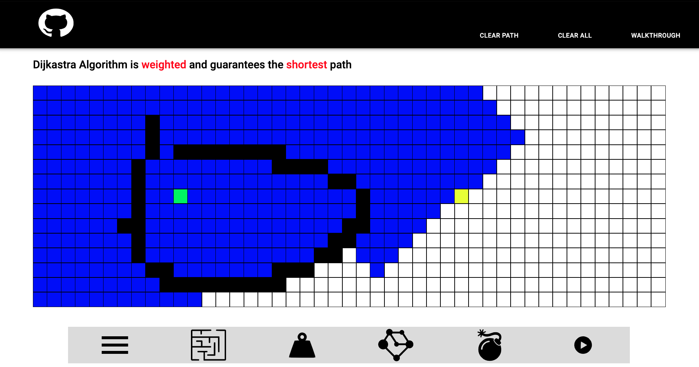

# How to run this project?

1. Clone the repo
2. Run the following commands

```
npm install
npm start
```

Update: Unweighted Dijkstra is Working now


# Tasklist

## TODO:

- Peripheral Nodes and Path Styles
- Get Path
- Adjust starting and finishing point
- Algorithm Reducers
- Clear path
- Walkthrough
- Connect to redux for handling clear and play

## Finished:

1. Able to Create Wall
2. Basic layout
3. Able to adjust wall
4. Wall Animation
5. Description Style
6. Dock Buttons
7. Tool tips
8. Fonts
9. Connect grid using redux
10. Global Constants
11. Change to node Object
12. Dijkstra algorithm
13. Dijkstra algorithm with wall
14. Wall Status in Redux
15. Clear All
16. Mark Animation End
17. Docker Icon Menu
